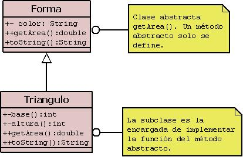

# Apuntes generales para notavos en Programación Orientada a Objetos con Java! :fire:

Tanto para mi yo del futuro como para cualquiera que llegue hasta aquí, he intentado dejar en estos tres archivos los conceptos claves sobre la programación orientada a objetos. Ni que decir tiene que estos apuntes no sustituyen al estudio profundo del lenguaje, pero creo que pueden sentar las bases (con un lenguaje ameno) de todos los conceptos. No he querido desarrollar muchos métodos ni constantes de clase para no abrumar a los no-iniciados en la materia o incluso a mi mismo, si en un futuro tengo que recurrir a estos archivos para refrescar concentos.

## Organización del proyecto
El programa se estructura en tres ficheros: en primer lugar una clase **Forma** de la que heredará la clase **Triángulo** así como una clase principal donde se prueba la funcionalidad del programa, llamada **Uso_Forma**.

<p align="center">
  </img>
</p>

#### Nombre de paquetes y clases
Por norma general, los paquetes se nombras con palabras en minúsculas, sin carácteres extraños y sin espacios, admitiendo números. Yo suelo nombrarlos de la siguiente manera: *paquete_poo_polimorfismo* ó *ejercicio01_herencia*.

En cuanto a las clases, las comienzo nombrando en mayúscula, sin espacios y pudiendo contener números también, algunos ejemplos serían: *Triángulo*, *Uso_Forma* o *Uso_Cuenta_Corriente3*.

En ambos casos, si no quieres recurrir a guiones bajos siempre puedes usar la notación Camel Case.

## Recursos previos
Recomiendo, para profundizar en el tema, el libro *"Aprender a programar con Java* de la editorial Paraninfo, el curso de Píldoras Informáticas de Java y la web [NTU](https://www.ntu.edu.sg/home/ehchua/programming/java/J3b_OOPInheritancePolymorphism.html).

## Conceptos sobre POO
### Constructores
Método especial para inicializar un objeto. Puede haber uno o varios constructores, en este último caso se hablaría de *"sobrecarga de constructores"* y variarían según el número de argumentos que le pasemos, esto también hará que Java sepa a qué constructor nos referimos: el constructor ```public Forma(String nombre)``` será distinto al constructor ```public Forma(String nombre, String color)```.

### Constantes o variables de clase
Son las variables o constantes definidas dentro de la clase. Para favorecer la encapsulación y evitar el modificarlas fuera de la clase que las define (para poder acceder a ellas se usarán métodos) se les aplica el modificador de acceso *private*.

### Métodos setter y getter
Métodos que se emplean para "rescatar" las variables o constantes de clase. Normalmente se suelen nombrar con ```set``` o ```get```seguido del nombre de la variable, por ejemplo: ```setColor(String color)```o ```setEdad(int edad)```.

### Operador this
Sirve para hacer referencia a las constantes o variables de clase. En el fragmento de código siguiente se definen dos variables de clase, de tipo String e int:

```private String nombre```
```private int edad```

Acto seguido, vamos a crear un método (siguiente apartado) para establecer una edad:

```setEdad(int edad)```

Fijarse que el método edad recibe un argumento de tipo entero llamado también edad. Ante esto, java no sabría interpretar cuándo nos referimos al argumento y cuando a la variable de clase, para ello está el operador this. Cuando lo usamos delante del nombre de la variable, Java entiende que hablamos de la variable de clase, no del argumento:

```
setEdad(int edad){
      this.edad = edad;
   }
```

Otro uso del this es emplearlo dentro de un constructor. Cuando usamos esta palabra, **siempre en la primera línea después de abrir las llaves del constructor** hacemos referencia a otro constructor (lo llamamos). El número de parámetros que le pasemos es lo que indicará a Java a qué constructor estamos llamando. Por ejemplo

```
public Cuenta(String titular, double cantidad) { ... }

public Cuenta(String titular) {
      this(titular, 0);
}
```

Esto se hace para que, al usar el constructor que solo recibe como argumento un parámetro, el otro (la cantidad) no quede sin definir. Con lo cual, en la llamada al segundo constructor con el *"this"* le indicamos que como primer parametro le pase el argumento titular y como segundo le pase 0.
    
### Métodos
Son las acciones que van a realizar los objetos que creemos. Un método setter o getter sería un método. Estos métodos pueden recibir parámetros o no. En el caso de este ejemplo, dentro de la clase Forma, tenemos el método getArea() y toString(). Hay mucho más que decir sobre los métodos, pero como idea general piensa que un método una acción.

### Modificadores de acceso
Son las palabras reservadas que se ponen delante de métodos, clases o variables/constantes para limitar su visibilidad.

Modificador | Clase | Paquete | Subclase | Todos
------------|-------|---------|----------|------
PUBLIC | SI | SI | SI | SI
PRIVATE | SI | NO | NO | NO
PROTECTED | SI | SI | SI | NO
POR DEFECTO | SI | SI | NO | NO

### Herencia
Tiene el mismo concepto que la herencia en la vida real. En el caso de la POO consiste en crear una clase que esta en la primera posición **(superclase)** y otras clases que heredan de ella **(subclases)**. Las clases que heredan tienen a su disposición los métodos y variables/constantes que hayamos definido. Para heredar de una clase usamos la palabra reservada **extends**:

```
public class Triangulo extends Forma { ... }
```

Con lo cual la clase Triangulo tendrá disponibles todos los métodos de la clase Forma. En Java, a diferencia de otros lenguajes, no existe la herencia múltiple, algo que se puede suplir con las Interfaces y clases abstractas.

### Interfaces
Se definen como un contrato. Las clases que la implementen estarán obligadas a desarrollar los métodos que se han definido en la interfaz. Se usan para dotar de más robustez al software y para solventar el problema de la falta de herencia múltiple. Para implementar una interface se usa la palabra reservada **implements**:

```
public class Forma implements Normas { ... }
```

### Sobreescritura de métodos
Cuando una clase hereda de otra, además de usar sus métodos puede sobreescribirlos, con lo cual pueden darle una funcionalidad propia. Cuando un método sobreescribe a otro el IDE suele identificarlo por medio de un icono. Se puede emplear la línea *@Override* para indicar que ese método está sobreescrito, pero esto es algo funcional y que solo dota de información al compilador

```
@Override
public String toString() { ... }
```

### Clases abstractas
Siguiendo con el ejemplo de la clase Forma, vamos a fijarnos en el método getArea(). Si lo pensamos, en la clase Forma todavía no sabemos qué figura geométrica es, por lo que no podemos calcular un área. Esto podríamos solventarlo así:

```
public String getArea(){
      return "Todavía no sé el área";
}
```

No obstante, para evitar este "error" se usan las **clases abstractas**. De esta manera, en la superclase definimos (NO DESARROLLAMOS) el método que queremos que implementen las clases que hereden de ella. Tanto el método como la clase Forma deberan de pasar a ser abstractos:

```
abstract class Forma{

      public String getArea();
}
```

Esta clase abstracta *no puede ser instanciada*, es decir, no se puede hacer *Forma triangulo = new Forma();*. Las clases abstractas son algo muy parecido a las interfaces, aunque estas últimas tienen sus métodos solo definidos, mientras que dentro de una clase normal podemos tener una clase abstracta y tres "normales" con sus métodos perfectamente desarrollados.

### Polimorfismo
Se puede utilizar un objeto de la subclase siempre que el programa espere un objeto de la superclase, es decir, un objeto se comporta de diferente manera dependiendo del contexto. Es decir, podríamos instanciar un objeto de la clase Triangulo de las siguientes maneras:

```
Forma r1 = new Forma();
Forma r2 = new Triangulo();
```

Como vemos, en el segundo caso el programa esperaba una superclase (Forma) y en cambio hemos usado un objeto de la subclase.

### Instanciar un objeto
Seguramente uno de los conceptos fundamentales, consiste en crear objetos de la clase creada por medio del operador **new**, sigue el siguiente patrón:

```
nombre_clase + nombre_que_queremos_darle = new + nombre_constructor
```

O de otro modo:

```
Forma mi_forma = new Triangulo(2, 3);
``` 

Como se puede ver se ha usado la clase Forma para crear un objeto de ella, seguido de un nombre para referirnos a el (le podemos dar el que queramos), igual al operador *new* seguido del constructor al que, en este caso se le han pasado dos parametros, base y altura, que tendrán que estar correctamente definidos en la clase Forma.

## this() is the end!
Espero que, de una manera general, haya quedado todo claro y yo haya sabido transmitir lo poco que se de Java. Continuar aprendiendo y, sobre todo, desarrollando vuestros propios proyectos y ejercicios, es la única manera de dominar un lenguaje.

Para más info podéis visitar mi web [JGCarrillo](http://jgcarrillo.com) o leerme en [Medium](https://medium.com/@ysjgomez). :v: :v:

